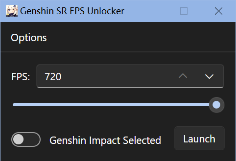

# Genshin Impact & Honkai: Star Rail FPS Unlocker

A forked version which rewrites GUI.
Modified by 30launcher

> Running in Windows 10 & 11

 - This tool helps you to unlock the 60 fps limit in the game
 - This is an external program which uses **WriteProcessMemory** to write the desired fps to the game
 - Handle protection bypass is already included
 - Does not require a driver for R/W access
 - Supports OS and CN version
 - Should work for future updates
 - If the source needs to be updated, I'll try to do it as soon as possible
 - You can download the compiled binary over at '[Release](https://github.com/34736384/genshin-fps-unlock/releases)' if you don't want to compile it yourself

 ## Compiling
 1. Install Visual Studio 2022 with Desktop C++ workload in Visual Studio Installer.
 2. Install .NET 8 SDK.
 3. Use `dotnet build ./unlockfps_gui` for regular compiling. Use `dotnet publish ./unlockfps_gui -c Release -r win-x64` for AOT publish.

 ## Usage
 
 ### Running on Windows

 - Run the exe and click 'Launch'
 - If it is your first time running, unlocker will attempt to find your game through the registry. If it fails, then it will ask you to either browse or run the game.
 - Place the compiled exe anywhere you want (except for the game folder)
 - Make sure your game is closed—the unlocker will automatically start the game for you
 - Run the exe as administrator, and leave the exe running
 >It requires adminstrator because the game needs to be started by the unlocker and the game requires such permission
 - To load other third-party plugins, go to `Options->Settings->DLLs` and click add

 ## Version 3.0.0 Changes
 - Rewritten the project in .NET 8
 - Added a launch option to use mobile UI (for streaming from mobile devices or touchscreen laptops)
 ## Notes
 - HoYoverse (miHoYo) is well aware of this tool, and you will not get banned for using **ONLY** fps unlock.
 - If you are using other third-party plugins, you are doing it at your own risk.
 - Any artifacts from unlocking fps (e.g. stuttering) is **NOT** a bug of the unlocker

